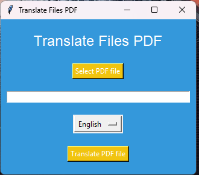
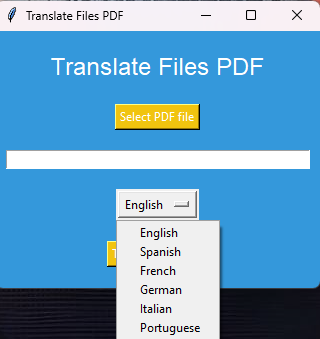

# Translate File PDF

## Introdução
O Translate File PDF é um aplicativo que permite traduzir arquivos PDF de um idioma para outro. Ele suporta dois modos de uso: diretamente no arquivo "translate.py" ou usando a tela do app no arquivo "main.py".

- Modo de Uso 1: Diretamente no Arquivo "translate.py"
Para usar o aplicativo diretamente no arquivo "translate.py", você precisa:

    1. Abrir o arquivo "translate.py" em um editor de código.
    2. Substituir o nome do arquivo PDF e o idioma de destino no código.
    3. Executar o código.

## Exemplo:

if __name__ == "__main__":
    asyncio.run(translate_file('my-file.pdf', 'pt'))
    print("Finished")

 - Modo de Uso 2: Usando a Tela do App no Arquivo "main.py"
Para usar o aplicativo usando a tela do app no arquivo "main.py", você precisa:

    1. Abrir o arquivo "main.py" em um editor de código.
    2. Executar o código.
    3. Selecionar o arquivo PDF que deseja traduzir.
    4. Selecionar o idioma de destino.
    5. Clicar no botão "Translate PDF file".

    <p align="center">
        
    </p>
    <p align="center">
        
    </p>


## Requisitos
- Python 3.x
- Bibliotecas: PyPDF2, googletrans, reportlab

Para instalar as bibliotecas necessárias, você pode usar o arquivo requirements.txt incluído no projeto. Basta executar o seguinte comando no terminal:

```bash
pip install -r requirements.txt
``` 

Isso instalará todas as bibliotecas necessárias para o aplicativo funcionar corretamente.

Observações
- O aplicativo usa a biblioteca googletrans para traduzir o texto do arquivo PDF.
- O aplicativo usa a biblioteca reportlab para criar um novo arquivo PDF com o texto traduzido.
- O aplicativo suporta apenas arquivos PDF.

Contato
Se você tiver alguma dúvida ou precisar de ajuda, por favor, entre em contato conosco.